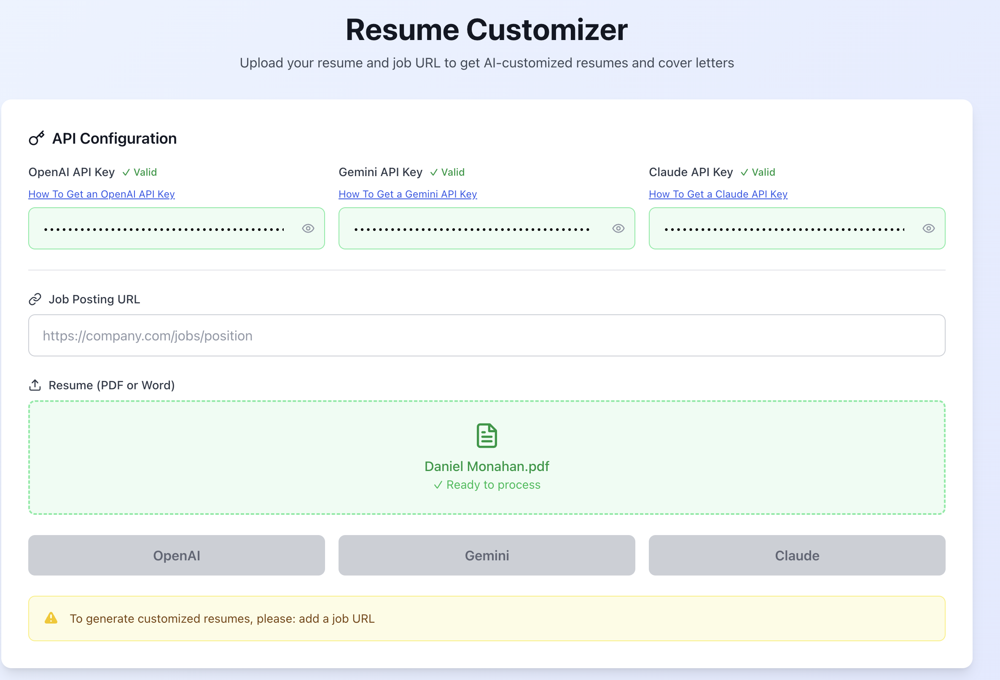
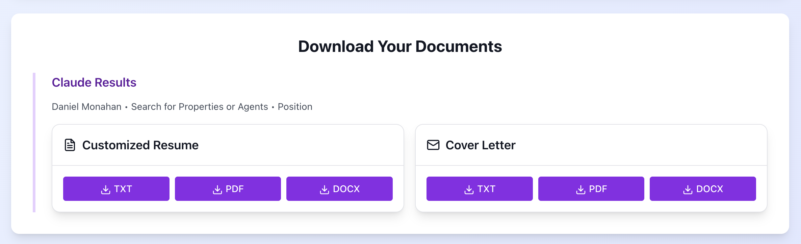

# Dan's Resume Customizer - AI-Powered Job Application Tool

## Overview


Dan's Resume Customizer is a lightweight web application that leverages multiple AI providers to automatically tailor resumes and generate cover letters for specific job postings. This tool addresses the common challenge job seekers face: customizing their application materials for each position while maintaining consistency and professional quality.

There are already several commercial applications that do this, but they can be expensive, limited in features, and its not always clear how they modify your resume, and with LLM hallucinations, this can be dangerous.
I have developed a fully Dockerized solution that runs locally on your machine and doesn't collect or share any data. You also don't need a sophisticated backend for processing as all calls to LLMs are direct. All you need is an API token to get started, and pay as you go.

This tool also generates a customized cover-letter as well!

You can download your results in three different formats: PDF, Word document, and a TXT file, for when you may need to copy and paste unformatted text into a job application.





### Core Problem Solved

In today's competitive job market, generic resumes often fail to pass Applicant Tracking Systems (ATS) or capture hiring managers' attention. This application solves this by:

- **Intelligent Keyword Integration**: Analyzes job descriptions to identify and incorporate relevant keywords naturally into your resume
- **Content Optimization**: Restructures and rewrites existing content to better align with job requirements
- **Professional Formatting**: Ensures ATS-friendly formatting while maintaining visual appeal
- **Cover Letter Generation**: Creates personalized cover letters that complement the customized resume

## Architecture Overview

The application follows a modern full-stack architecture designed for scalability and maintainability:

### Frontend Architecture (React)
```
src/
├── App.js              # Main application component
├── index.js           # React entry point
├── index.css          # Global styles
└── components/        # Reusable UI components
```

The frontend is built as a Single Page Application (SPA) using React 18 with functional components and hooks. It manages complex state including API keys, file uploads, and processing results across multiple AI providers.

### Backend Architecture (Express.js)
```
backend/
├── server.js          # Main server file with all routes and logic
└── package.json       # Backend dependencies
```

The backend serves as both an API server and a coordination layer between multiple external services:

- **File Processing Pipeline**: Handles PDF and Word document parsing
- **Web Scraping Engine**: Extracts job descriptions from URLs using Puppeteer
- **AI Integration Layer**: Manages communication with OpenAI, Gemini, and Claude APIs
- **Document Generation**: Creates formatted PDF and Word documents

### Data Flow Architecture

Understanding how data flows through the system helps explain the application's architecture:

1. **Input Phase**: User uploads resume and provides job URL
2. **Extraction Phase**: Backend parses resume content and scrapes job description
3. **AI Processing Phase**: Multiple AI providers analyze and optimize content
4. **Generation Phase**: System creates formatted documents in multiple formats
5. **Delivery Phase**: Frontend presents results with download options

## Technology Stack Deep Dive

### Frontend Technologies

**React 18**: Chosen for its mature ecosystem and excellent state management capabilities. The application uses modern React patterns including:
- Functional components with hooks for state management
- useEffect for side effects like API key persistence
- Complex state management for handling multiple concurrent AI requests

**Tailwind CSS**: Provides utility-first styling that enables rapid UI development while maintaining consistency. The design system uses a professional color palette with blue tones for trust and green accents for success states.

**Lucide React**: Icon library that provides consistent, professional iconography throughout the interface.

### Backend Technologies

**Express.js**: Lightweight and flexible web framework that handles multiple responsibilities:
- File upload processing with Multer middleware
- CORS handling for cross-origin requests
- Static file serving for the built React application

**Puppeteer**: Headless Chrome automation for web scraping. This choice enables:
- JavaScript-rendered content extraction
- Robust handling of various job posting sites
- Clean text extraction without HTML artifacts

**Multiple Document Libraries**:
- **PDF-Parse**: Extracts text from uploaded PDF resumes
- **Mammoth**: Handles Microsoft Word document parsing
- **PDFKit**: Generates professionally formatted PDF outputs
- **DOCX**: Creates Microsoft Word compatible documents

### AI Integration Strategy

The application integrates with three major AI providers to offer users choice and redundancy:

**OpenAI GPT-4**: Known for high-quality text generation and strong instruction following
**Google Gemini**: Offers competitive performance with different strengths in analysis
**Anthropic Claude**: Provides excellent reasoning capabilities and safety features

Each provider uses carefully crafted prompts designed to produce consistent, structured output using a custom marker format that ensures reliable document generation.

## Installation and Setup

### Prerequisites

Before setting up the application, ensure you have:
- Node.js (version 18 or higher) installed on your system
- npm or yarn package manager
- At least one AI provider API key (OpenAI, Gemini, or Claude)

### Step-by-Step Installation

**1. Clone and Setup Frontend**
```bash
# Clone the repository
git clone https://github.com/monahand1023/resume-generator
cd resume-generator

# Install frontend dependencies
npm install

# Build the React application
npm run build
```

**2. Backend Setup**
```bash
# Navigate to backend directory
cd backend

# Install backend dependencies
npm install
```

**3. Environment Configuration**

The application uses environment variables for configuration. Create a `.env` file in the backend directory:

```bash
# Backend server configuration
PORT=3000
NODE_ENV=production

# Puppeteer configuration (optional)
PUPPETEER_EXECUTABLE_PATH=/usr/bin/chromium-browser
```

**4. Start the Application**
```bash
# From the backend directory
npm start
```

The server will start on port 3000 and serve both the API and the React frontend.

### Docker Deployment

For production deployment, the application includes Docker configuration:

```bash
# Build and run with Docker Compose
docker-compose up --build
```

This creates a containerized environment with all dependencies included, making deployment consistent across different environments.

## User Flow Documentation

Understanding the user journey helps appreciate the application's design decisions and user experience considerations.

### Primary User Flow: Resume Customization

**Step 1: API Configuration**
Users begin by entering their API keys for one or more AI providers. The application:
- Validates API key formats using simple pattern matching
- Stores keys securely in browser localStorage for convenience
- Provides helpful links to obtain API keys from each provider
- Shows visual indicators for valid/invalid key formats

**Step 2: Job URL Input**
Users paste the URL of a job posting they're interested in. The system:
- Accepts any valid URL format
- Will later use this URL to scrape the job description
- Validates URL format before allowing submission

**Step 3: Resume Upload**
The application supports both PDF and Microsoft Word formats through:
- Drag-and-drop interface for intuitive file upload
- Click-to-browse traditional file selection
- Real-time validation of file types
- Visual feedback showing upload status

**Step 4: AI Provider Selection**
Users can choose between OpenAI, Gemini, or Claude based on:
- Their available API keys
- Personal preferences for AI provider characteristics
- Processing speed requirements (different providers have varying response times)

**Step 5: Processing and Results**
The application processes the request through several stages:
- File parsing to extract resume text
- Web scraping to obtain job description
- AI analysis and content optimization
- Document generation in multiple formats

**Step 6: Download and Review**
Users receive comprehensive results including:
- Customized resume in TXT, PDF, and DOCX formats
- Personalized cover letter in multiple formats
- Detailed analysis of changes made to the original resume

### Secondary User Flow: Multi-Provider Comparison

Advanced users often run the same resume through multiple AI providers to compare results:

**Parallel Processing**: Users can submit to multiple providers simultaneously, allowing direct comparison of different AI approaches to resume optimization.

**Results Comparison**: The interface displays results from each provider separately, making it easy to identify the best optimization for specific job applications.

## Technical Implementation Details

### File Processing Pipeline

The application handles document processing through a pipeline designed for reliability and format preservation:

**PDF Processing**: Uses the pdf-parse library to extract raw text while preserving structure. The system handles various PDF formats including those created by different word processors.

**Word Document Processing**: Employs Mammoth.js to extract text from .docx files while maintaining formatting information that helps preserve the document's logical structure.

**Text Extraction Strategy**: Both processors output clean text that removes formatting artifacts while preserving essential structure like line breaks and spacing that indicate section boundaries.

### Web Scraping Implementation

The job description extraction uses Puppeteer for robust content retrieval:

**Headless Browser Approach**: Unlike simple HTTP requests, Puppeteer renders JavaScript, ensuring complete content extraction from modern job posting sites.

**Content Cleaning**: The system removes script tags, style elements, and other non-content elements to provide clean text for AI analysis.

**Error Handling**: Robust error handling manages network timeouts, blocked requests, and sites that prevent automated access.

### AI Prompt Engineering

Each AI provider receives carefully engineered prompts designed to produce consistent, high-quality results:

**Structured Output Format**: All providers use a custom marker format that enables reliable parsing and document generation. This format includes markers like:
- `NAME:` for applicant names
- `SECTION:` for resume sections
- `BULLET:` for achievement points
- `COMPANY:` for employer information

**Content Preservation Strategy**: Prompts specifically instruct AI providers to retain all original content while optimizing presentation and keyword integration.

**Quality Assurance**: Multiple prompt iterations ensure consistent output quality across different AI providers and job types.

### Document Generation System

The application generates professional documents through specialized libraries:

**PDF Generation**: PDFKit creates styled PDFs with:
- Professional typography using system fonts
- Consistent spacing and layout
- Color-coded sections for visual hierarchy
- ATS-friendly formatting

**Word Document Creation**: The DOCX library generates Microsoft Word compatible files with:
- Proper heading hierarchies
- Consistent styling throughout
- Margin and spacing optimization
- Professional color schemes

## API Integration Architecture

### OpenAI Integration

The OpenAI integration uses the Chat Completions API with GPT-4:

```javascript
// Simplified example of OpenAI request structure
const response = await fetch('https://api.openai.com/v1/chat/completions', {
    method: 'POST',
    headers: {
        'Authorization': `Bearer ${apiKey}`,
        'Content-Type': 'application/json'
    },
    body: JSON.stringify({
        model: 'gpt-4',
        messages: [{ role: 'user', content: prompt }],
        max_tokens: 2000,
        temperature: 0.7
    })
});
```

**Error Handling**: Comprehensive error handling manages quota limits, authentication failures, and content policy violations.

### Gemini Integration

Google's Gemini API integration uses the generateContent endpoint:

```javascript
// Gemini API request structure
const response = await fetch(`https://generativelanguage.googleapis.com/v1beta/models/gemini-1.5-pro:generateContent?key=${apiKey}`, {
    method: 'POST',
    headers: { 'Content-Type': 'application/json' },
    body: JSON.stringify({
        contents: [{ parts: [{ text: prompt }] }],
        generationConfig: {
            temperature: 0.4,
            maxOutputTokens: 8000
        }
    })
});
```

**Safety Settings**: Configured safety filters prevent potentially harmful content while allowing professional resume content.

### Claude Integration

Anthropic's Claude integration uses the official SDK:

```javascript
// Claude integration using official SDK
const anthropic = new Anthropic({ apiKey });
const message = await anthropic.messages.create({
    model: 'claude-3-5-sonnet-20241022',
    max_tokens: 3000,
    messages: [{ role: 'user', content: prompt }]
});
```

**Response Handling**: Structured parsing extracts content from Claude's message format while handling potential safety blocks.

## Security and Privacy Considerations

### API Key Management

The application implements client-side API key storage for user convenience while maintaining security:

**Browser Storage**: API keys are stored in localStorage, keeping them on the user's device rather than server-side storage.

**No Server Persistence**: The backend never stores API keys, processing them only during active requests.

**Secure Transmission**: All API communications use HTTPS to prevent interception during transmission.

### Data Handling

**Temporary Processing**: Resume content and job descriptions are processed in memory only, with no persistent storage on the server.

**No Data Retention**: The application doesn't retain user documents or generated content after processing completion.

**CORS Protection**: Proper CORS configuration prevents unauthorized cross-origin requests.

## Performance Optimization

### Frontend Optimizations

**Component Architecture**: React components are designed for efficient re-rendering, with state updates isolated to minimize unnecessary renders.

**Asset Optimization**: Tailwind CSS purges unused styles, and the build process optimizes JavaScript bundles for faster loading.

**Progressive Loading**: The interface provides immediate feedback during long-running operations, keeping users engaged during AI processing.

### Backend Optimizations

**Concurrent Processing**: Multiple AI providers can process requests simultaneously, reducing total processing time when users want to compare results.

**Memory Management**: File processing uses streams where possible to handle large documents without excessive memory usage.

**Error Recovery**: Robust error handling prevents single failures from affecting other operations.

## Troubleshooting Common Issues

### API Key Problems

**Invalid Format Errors**: The application validates API key formats before submission. Ensure keys match expected patterns:
- OpenAI: starts with "sk-"
- Gemini: starts with "AI"
- Claude: starts with "sk-ant-"

**Quota Exceeded**: API providers have usage limits. Check your billing status and usage quotas in your provider dashboard.

### File Upload Issues

**Unsupported Format**: Only PDF and Microsoft Word (.docx) files are supported. Convert other formats before uploading.

**Large File Handling**: Very large files may cause processing delays. Consider reducing file size if processing takes excessive time.

### Web Scraping Limitations

**Protected Sites**: Some job posting sites block automated access. Try copying the job description manually if scraping fails.

**JavaScript-Heavy Sites**: Complex sites may not render completely. The system handles most modern job boards, but some specialized platforms may require manual intervention.

## Future Enhancement Opportunities

### Planned Features

**Resume Templates**: Integration of industry-specific resume templates to provide additional customization options.

**Batch Processing**: Ability to process multiple resumes or job applications simultaneously.

**Analytics Dashboard**: Insights into resume optimization patterns and success metrics.

### Technical Improvements

**Caching Layer**: Implementation of intelligent caching to reduce API costs and improve response times.

**Enhanced Parsing**: More sophisticated document parsing to better preserve formatting and structure.

**Mobile Optimization**: Enhanced mobile interface for users who need to customize resumes on mobile devices.

## Contributing and Development

### Development Environment Setup

For developers interested in contributing or customizing the application:

```bash
# Frontend development server
npm start  # Runs on port 3000

# Backend development server
cd backend
npm run dev  # If you add nodemon for development
```

### Code Structure Guidelines

**Frontend Components**: Each major UI section should be a separate component for maintainability.

**Backend Modules**: Consider separating AI provider integrations into individual modules as the codebase grows.

**Error Handling**: Maintain consistent error handling patterns across all components.
