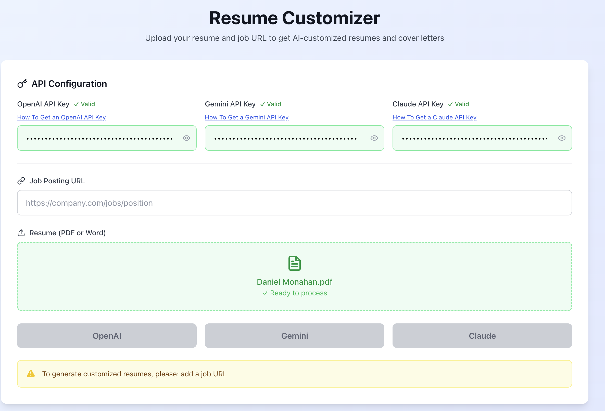
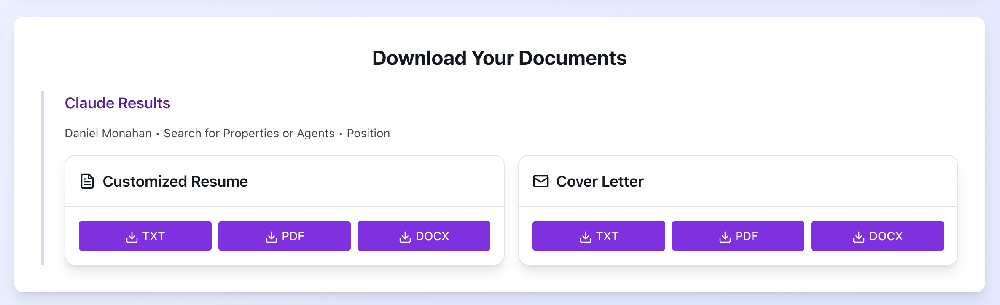

# Resume Customizer

AI-powered resume tailoring and cover letter generation. Upload your resume, paste a job URL, pick an AI provider — get a keyword-optimized resume and matching cover letter back in PDF, DOCX, Markdown, or clean plain text.

Runs locally via Docker. No data is stored or shared. You bring your own API key.




## Tech Stack

- **Frontend**: React 18, Tailwind CSS
- **Backend**: Node.js, Express.js, Puppeteer (job scraping)
- **AI Providers**: OpenAI GPT-4, Google Gemini, Anthropic Claude, Amazon Bedrock (Nova)
- **Document generation**: PDFKit (PDF), DOCX library (Word)

## Quick Start

```bash
git clone https://github.com/monahand1023/resume-generator
cd resume-generator

# Install and build frontend
npm install && npm run build
cp -r build backend/public

# Install backend
cd backend && npm install
cp ../.env.example .env   # fill in your API keys

npm start   # http://localhost:3000
```

Or with Docker:

```bash
docker-compose up --build
```

Or run the prebuilt image from GitHub Container Registry:

```bash
docker run -p 3000:3000 --env-file backend/.env ghcr.io/monahand1023/resume-generator:latest
```

## Environment Variables

Copy `.env.example` to `backend/.env`. Required variables:

| Variable | Purpose |
|---|---|
| `PORT` | Server port (default: 3000) |
| `PUPPETEER_EXECUTABLE_PATH` | Chromium path (Docker/CI only) |

At least one AI provider is required. The three cloud providers use a key
entered in the UI (stored in browser `localStorage` only, never server-side):

- OpenAI key (`sk-...`) for GPT-4
- Google Gemini key (`AIza...`)
- Anthropic Claude key (`sk-ant-...`)

**Amazon Bedrock (Nova)** is also available as a provider, but it authenticates
with *server-side* AWS credentials rather than a user key. It appears in the UI
only when the server is configured for AWS. Enable it with standard AWS
credentials (`AWS_PROFILE`, static keys, or an ambient IAM role) or force it on
with `BEDROCK_ENABLED=true`. Tunables: `BEDROCK_MODEL_ID` (default
`us.amazon.nova-lite-v1:0`), `AWS_REGION`/`BEDROCK_REGION` (default `us-west-2`).

All other tunables are env-driven — see `backend/config.js` for the full list and
defaults. Notable ones: per-provider models, timeouts, rate limits, file-size
cap, job TTL, `JD_MAX_LENGTH`, the in-memory result-cache TTL
(`RESULT_CACHE_TTL_MS`, default 24h), and the preview rate limit
(`RATE_LIMIT_PREVIEW_MAX`, default 30/hour).

Optional: `SMTP_*` vars for email delivery; `GOOGLE_SERVICE_ACCOUNT_CREDENTIALS` + `GOOGLE_SPREADSHEET_ID` for Sheets logging.

`GET /api/providers` reports which providers this server supports and which need
a user key, so the frontend renders only the available ones.

## Features

- Upload PDF or DOCX resume; paste any job posting URL
- AI scrapes the JD and rewrites your resume with targeted keywords
- Generates a matching cover letter
- Shows a diff-style summary of what changed and why
- **Preview inputs before running** — see the scraped job description and parsed
  resume text (and the company/position detected from them) *without* spending
  any AI tokens, so you can catch a bad scrape early
- **Output validation** — malformed AI output is caught and surfaced as a
  retryable error instead of producing a broken/empty document
- **Result caching** — re-running the same resume + job URL + provider reuses the
  prior result instead of re-spending API tokens (in-memory, never written to disk)
- Exports to clean plain text (ATS paste), Markdown, PDF, and DOCX
- Run multiple providers in parallel to compare outputs

## API

**`POST /api/customize-resume`** — multipart/form-data

| Field | Type | Description |
|---|---|---|
| `resume` | file | PDF or DOCX, max 10 MB |
| `jobUrl` | string | Job posting URL to scrape (validated for SSRF — private/reserved IPs rejected) |
| `apiKey` | string | Provider API key (omit for server-credential providers like `bedrock`) |
| `provider` | string | `openai`, `gemini`, `claude`, or `bedrock` |

Runs asynchronously — returns `{ jobId }`; poll `GET /api/job/:jobId` or stream
`GET /api/job/:jobId/stream` (SSE) for the result. Output is validated for the
expected marker format before the job completes, and an identical re-run is
served from the in-memory result cache.

**`POST /api/preview`** — multipart/form-data (`resume`, `jobUrl`). Scrapes and
parses the inputs *without* calling the AI; returns
`{ jobDescription, resumeText, metadata: { name, company, position } }`. Same
SSRF validation as customize.

**`POST /api/format-document`** — JSON (`content`, `format`, `filename`, `metadata`):
renders AI output text to a downloadable file. `format` is one of `txt` (clean,
marker-stripped ATS plain text), `md` (Markdown), `pdf`, or `docx`.

**`GET /api/providers`** — lists supported providers and whether each needs a user key.

## Security

- API keys entered in the UI are stored in browser `localStorage` only — never sent to or persisted by the server (and redacted from server logs)
- Resume content and job descriptions are processed in memory; nothing is written to disk
- **SSRF protection**: job URLs are validated before scraping — only http/https, and any hostname resolving to a private/reserved IP (RFC 1918, loopback, link-local, cloud metadata at 169.254.169.254) is rejected, including across redirects
- CORS, CSP, and standard security headers configured

## License

MIT
